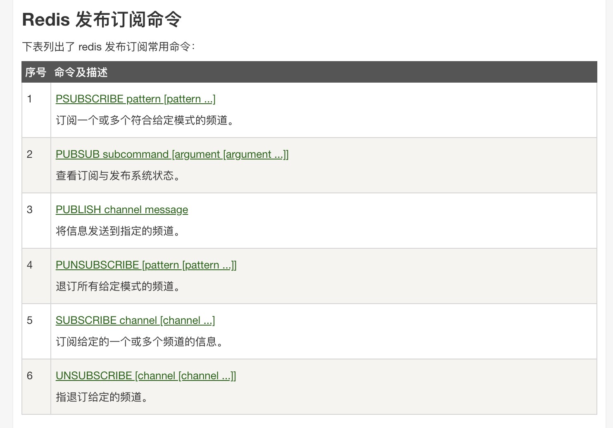
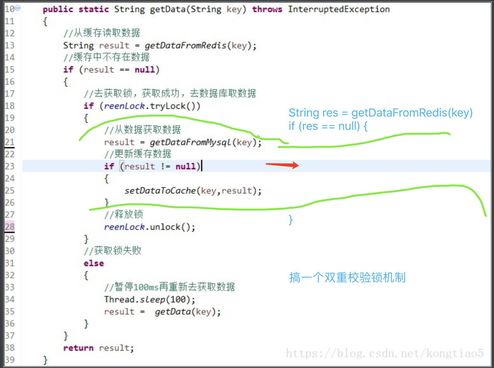

# cas-redis

# 线上redis测试网站
https://try.redis.io/

# redis命令文档网站
http://doc.redisfans.com/

# 参数配置
    # REDIS (RedisProperties)
    # Redis数据库索引（默认为0）
    spring.redis.database=0
    # Redis服务器地址
    spring.redis.host=localhost
    # Redis服务器连接端口
    spring.redis.port=6379
    # Redis服务器连接密码（默认为空）
    spring.redis.password=qpc_redis
    # 连接池最大连接数（使用负值表示没有限制）
    spring.redis.pool.max-active=8
    # 连接池最大阻塞等待时间（使用负值表示没有限制）
    spring.redis.pool.max-wait=-1
    # 连接池中的最大空闲连接
    spring.redis.pool.max-idle=8
    # 连接池中的最小空闲连接
    spring.redis.pool.min-idle=0
    # 连接超时时间（毫秒）
    spring.redis.timeout=0

## spring-session和springboot整合博客
    https://developer.aliyun.com/article/182676
    
    为什么要有spring-session，我们知道单机的时候session可以存储一些数据，这样每次用户请求我们都能使用这些数据，但是我们如果采用分布式去部署应用，那么
    session就不在一起，可能负载的时候就会拿不到数据，导致问题。那么我们怎么去解决这一困境呢？
    答：spring提供了组建，spring-session就是用来帮助我们来解决如上问题，我们知道session是存储在jvm的堆中的，我们如果将这个存储区域抽取出来进行统一管理
    的话就可以解决session不同步的问题，让jvm找session去redis或者jdbc中查询，这样就可以解决上述问题。至此spring-session的功能介绍完毕，实现的demo在这个项目
    中，请查收

## String
    
```bash
xianglong@123 ~ % redis-cli
127.0.0.1:6379> set name xianglong
OK
127.0.0.1:6379> get name
"xianglong"
127.0.0.1:6379> getrange name 0 2
"xia"
127.0.0.1:6379> getset name xl
"xianglong"
127.0.0.1:6379> get name
"xl"
127.0.0.1:6379> getbit name 2
(integer) 1
127.0.0.1:6379> getbit name 1
(integer) 1
127.0.0.1:6379> set a 1
OK
127.0.0.1:6379> incr a
(integer) 2
127.0.0.1:6379> get a
"2"
127.0.0.1:6379> incr a
(integer) 3
127.0.0.1:6379> decr a
(integer) 2
127.0.0.1:6379> get a
"2"
127.0.0.1:6379> 
```

### list
    1、基本数据类型，列表
    2、list可以当作栈、队列、阻塞队列 

### 事物
    1、开启事物【multi】
    2、命令入队【set name xl;get name】
    3、执行事物【exec】
    4、or取消事物【discard】·不关心
    不保证原子性，错误命令会报异常，但不会中断执行
```bash
127.0.0.1:6379(TX)> set k1 "xl"
QUEUED
127.0.0.1:6379(TX)> incr k1
QUEUED
127.0.0.1:6379(TX)> get k1
QUEUED
127.0.0.1:6379(TX)> exec
1) OK
2) (error) ERR value is not an integer or out of range
3) "xl"
```    
    
### 乐观锁CAS
    1、获取version
    2、更新 的时候比较version
```bash
127.0.0.1:6379> set money 100
OK
127.0.0.1:6379> set out 0
OK
127.0.0.1:6379> watch money #监控money
OK
127.0.0.1:6379> multi #事物正常结束、数据期间没有发生变动、这个时候就可以正常执行
OK
127.0.0.1:6379(TX)> DECRBY money 20
QUEUED
127.0.0.1:6379(TX)> incrby out 20
QUEUED
127.0.0.1:6379(TX)> exec
1) (integer) 80
2) (integer) 20
######## 多线程 修改指，使用watch可以当作redis的乐观锁操作
127.0.0.1:6379> watch money
OK
127.0.0.1:6379> multi
OK
127.0.0.1:6379(TX)> decrby money 20
QUEUED
127.0.0.1:6379(TX)> incrby out 20
QUEUED
127.0.0.1:6379(TX)> exec
(nil)
127.0.0.1:6379> 
########### 新线程的操作 ################
Last login: Fri Jul  2 17:57:08 on ttys001
xianglong@123 ~ % redis-cli
127.0.0.1:6379> set money 1000
OK
127.0.0.1:6379> 
```    
### springboot启动配置redis
```java
@Configuration(proxyBeanMethods = false)
@ConditionalOnClass(RedisOperations.class)
@EnableConfigurationProperties(RedisProperties.class)
@Import({ LettuceConnectionConfiguration.class, JedisConnectionConfiguration.class })
public class RedisAutoConfiguration {

	@Bean
	@ConditionalOnMissingBean(name = "redisTemplate")
	@ConditionalOnSingleCandidate(RedisConnectionFactory.class)
	public RedisTemplate<Object, Object> redisTemplate(RedisConnectionFactory redisConnectionFactory) {
		RedisTemplate<Object, Object> template = new RedisTemplate<>();
		template.setConnectionFactory(redisConnectionFactory);
		return template;
	}

	@Bean
	@ConditionalOnMissingBean
	@ConditionalOnSingleCandidate(RedisConnectionFactory.class)
	public StringRedisTemplate stringRedisTemplate(RedisConnectionFactory redisConnectionFactory) {
		StringRedisTemplate template = new StringRedisTemplate();
		template.setConnectionFactory(redisConnectionFactory);
		return template;
	}
}
 ```

### rdb数据恢复
    优点：1、恢复效率高，适用数据量大
         2、对数据完整性要求不高
    缺点：1、会丢失一段时间的数据，可配置
```bash
172.16.116.139:6379> config get dir
1) "dir"
2) "/usr/local/redis/bin" # 如果这个目录存在dump.rdb文件，启动就会自动恢复数据
172.16.116.139:6379> 
```

### aof数据恢复
    优点：1、每一秒都同步，文件完整性更高
         2、每秒同步一次，可能会丢失一秒的数据
         3、从不同步，效率最高的！
         # appendfsync always
         appendfsync everysec
         # appendfsync no
         
    缺点：1、相对于数据文件来说，aof远远大于rdb，修复的速度也比rdb慢
         2、aof涉及大量io操作，执行效率比rdb慢，所以我们默认使用rdb持久化
         
         
```bash
[root@localhost bin]# cat appendonly.aof 
*2
$6
SELECT
$1
0
*3
$3
set
$4
name
$9
xianglong
*3
$3
set
$2
k1
$2
v1222
[root@localhost bin]# ./redis-check-aof --fix appendonly.aof  #数据修复，直接干掉错误的行，牛逼
0x              56: Expected \r\n, got: 3232
AOF analyzed: size=93, ok_up_to=61, diff=32
This will shrink the AOF from 93 bytes, with 32 bytes, to 61 bytes
Continue? [y/N]: y
Successfully truncated AOF
[root@localhost bin]# cat appendonly.aof 
*2
$6
SELECT
$1
0
*3
$3
set
$4
name
$9
xianglong
[root@localhost bin]# 
```

### 发布订阅

    适用场景：1、聊天系统
            2、关注订阅系统

```bash
-- bash1 ---
xianglong@123 ~ % redis-cli -h 172.16.116.139 -p 6379
172.16.116.139:6379> SUBSCRIBE xianglong
Reading messages... (press Ctrl-C to quit)
1) "subscribe"
2) "xianglong"
3) (integer) 1
1) "message"
2) "xianglong"
3) "xl"

-- bash2 ---
172.16.116.139:6379> publish xianglong "xl"
(integer) 1

```

### 主从复制
    优点：比单节点性能高，解放读性能
    缺点：master宕机，写节点缺失
    如果主机断开，我们可以使用"SLAVEOF no one" 让自己变成主机
```bash
172.16.116.139:6379> info replication
# Replication
role:master
connected_slaves:0
master_replid:e44d3d76978a10e85e613d64dcd24865484fdf07
master_replid2:0000000000000000000000000000000000000000
master_repl_offset:0
second_repl_offset:-1
repl_backlog_active:0
repl_backlog_size:1048576
repl_backlog_first_byte_offset:0
repl_backlog_histlen:0
```

```bash
[root@localhost bin]# ps -ef | grep redis
root      10703      1  0 12:54 ?        00:00:00 ./redis-server 0.0.0.0:6379
root      10776      1  0 12:55 ?        00:00:00 ./redis-server 0.0.0.0:6380
root      10848      1  0 12:56 ?        00:00:00 ./redis-server 0.0.0.0:6381
root      10895   7401  0 12:57 pts/2    00:00:00 grep --color=auto redis
```

== 搭建主从 slaveof 127.0.0.1 6379 ==
## 命令
```bash
--- bash80 ---
127.0.0.1:6380> info replication
# Replication
role:master
connected_slaves:0
master_replid:9568e5fcc2678f819edf03e75e83ea3e7ac59398
master_replid2:0000000000000000000000000000000000000000
master_repl_offset:0
second_repl_offset:-1
repl_backlog_active:0
repl_backlog_size:1048576
repl_backlog_first_byte_offset:0
repl_backlog_histlen:0
127.0.0.1:6380> slaveof 127.0.0.1 6379
OK
127.0.0.1:6380> info replication
# Replication
role:slave
master_host:127.0.0.1
master_port:6379
master_link_status:up
master_last_io_seconds_ago:1
master_sync_in_progress:0
slave_repl_offset:14
slave_priority:100
slave_read_only:1
connected_slaves:0
master_replid:bcec0eb793fca0328952f0b5ae6b797059252488
master_replid2:0000000000000000000000000000000000000000
master_repl_offset:14
second_repl_offset:-1
repl_backlog_active:1
repl_backlog_size:1048576
repl_backlog_first_byte_offset:1
repl_backlog_histlen:14
127.0.0.1:6380> 
```

## 配置
    在启动的配置文件中，配置如下即可永久认 127.0.0.1:6379为主节点
```bash
# replicaof <masterip> <masterport>
replicaof 127.0.0.1 6379
```

## redis缓存删除策略
    1.volatile-lru(least recently used):最近最少使用算法，从设置了过期时间的键中选择空转时间最长的键值对清除掉；
    2.volatile-lfu(least frequently used):最近最不经常使用算法，从设置了过期时间的键中选择某段时间之内使用频次最小的键值对清除掉；
    3.volatile-ttl:从设置了过期时间的键中选择过期时间最早的键值对清除；
    4.volatile-random:从设置了过期时间的键中，随机选择键进行清除；
    5.allkeys-lru:最近最少使用算法，从所有的键中选择空转时间最长的键值对清除；
    6.allkeys-lfu:最近最不经常使用算法，从所有的键中选择某段时间之内使用频次最少的键值对清除；
    7.allkeys-random:所有的键中，随机选择键进行删除；
    8.noeviction:不做任何的清理工作，在redis的内存超过限制之后，所有的写入操作都会返回错误；但是读操作都能正常的进行;

## sentinel配置
```bash
daemonize yes 
port 7505
#指定工作目录
dir "/usr/local/redis-sentinel/7505"
logfile "./sentinel.log" 
#指定别名  主节点地址  端口  哨兵个数（有几个哨兵监控到主节点宕机执行转移）
sentinel monitor mymaster 127.0.0.1 7501 2
#如果哨兵3s内没有收到主节点的心跳，哨兵就认为主节点宕机了，默认是30秒  
sentinel down-after-milliseconds mymaster 3000
#选举出新的主节点之后，可以同时连接从节点的个数
sentinel parallel-syncs mymaster 1
#如果10秒后,master仍没活过来，则启动failover,默认180s  
sentinel failover-timeout mymaster 10000 
#配置连接redis主节点密码  
sentinel auth-pass mymaster 123456
```    

### 缓存穿透、缓存击穿、缓存雪崩
    [缓存穿透]描述：缓存穿透是指缓存和数据库中都没有的数据，而用户不断发起请求，如发起为id为“-1”的数据或id为特别大不存在的数据。这时的用户很可能是攻击者，攻击会导致数据库压力过大。
    解决方案：
    1、接口层增加校验，如用户鉴权校验，id做基础校验，id<=0的直接拦截；
    2、从缓存取不到的数据，在数据库中也没有取到，这时也可以将key-value对写为key-null，缓存有效时间可以设置短点，如30秒（设置太长会导致正常情况也没法使用）。这样可以防止攻击用户反复用同一个id暴力攻击
    3、布隆过滤器，百分百能判断不存在，大概率判断存在
    
    [缓存击穿]描述：缓存击穿是指缓存中没有但数据库中有的数据（一般是缓存时间到期），这时由于并发用户特别多，同时读缓存没读到数据，又同时去数据库去取数据，引起数据库压力瞬间增大，造成过大压力
    解决方案
    1、设置热点数据永远不过期。
    2、加互斥锁，互斥锁（不能规避线程A从数据库取key1的数据并不妨碍线程B取key2的数据，这种情况是有问题的）参考代码如下

    说明：
    1）缓存中有数据，直接走上述代码13行后就返回结果了
    2）缓存中没有数据，第1个进入的线程，获取锁并从数据库去取数据，没释放锁之前，其他并行进入的线程会等待100ms，再重新去缓存取数据。这样就防止都去数据库重复取数据，重复往缓存中更新数据情况出现。
    3）当然这是简化处理，理论上如果能根据key值加锁就更好了，就是线程A从数据库取key1的数据并不妨碍线程B取key2的数据，上面代码明显做不到这点

    [缓存雪崩]描述：缓存雪崩是指缓存中数据大批量到过期时间，而查询数据量巨大，引起数据库压力过大甚至down机。和缓存击穿不同的是，        
    缓存击穿指并发查同一条数据，缓存雪崩是不同数据都过期了，很多数据都查不到从而查数据库。
    解决方案：
    1、设置热点数据永远不过期。
    2、缓存数据的过期时间设置随机，防止同一时间大量数据过期现象发生。
    
      
             
    
[主从配置79](./src/main/resources/static/conf/cluster/redis79.conf)        
[主从配置80](./src/main/resources/static/conf/cluster/redis80.conf)        
[主从配置81](./src/main/resources/static/conf/cluster/redis81.conf)        
[主从启动sh](./src/main/resources/static/conf/cluster/cluster_start.sh)
        
[哨兵配置80](./src/main/resources/static/conf/sentinel/sentinel80.conf)        
[哨兵配置81](./src/main/resources/static/conf/sentinel/sentinel81.conf)        
[哨兵集群启动sh](./src/main/resources/static/conf/sentinel/sentinel_start.sh)        

[redis序列化和反序列化](./src/main/java/com/cas/config/RedisConfig.java)   
[swagger配置](./src/main/java/com/cas/config/Swagger2Config.java)   
[redis注入自定义RedisTemplate](./src/main/java/com/cas/config/RedisConfig.java)   

[布隆过滤器讲解](https://juejin.cn/post/6844904007790673933)   
[我的书签](./src/main/resources/static/bookmarks_2021_7_2.html)


### 如何保证redis和mysql数据一致性
    孤独烟：https://www.cnblogs.com/rjzheng/p/9041659.html
    ktoking：https://blog.csdn.net/kingtok/article/details/106689121  延迟双删 + biglog日志订阅
    呆东：https://blog.csdn.net/huxiaodong1994/article/details/102906696  biglog日志